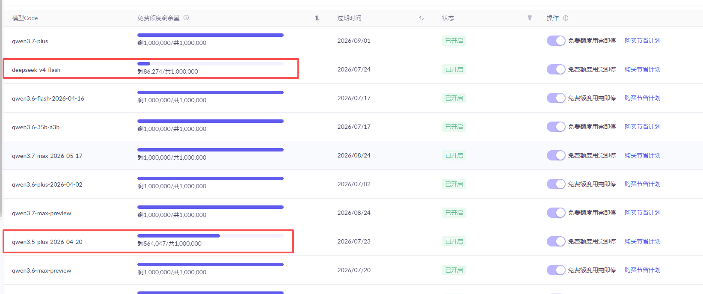
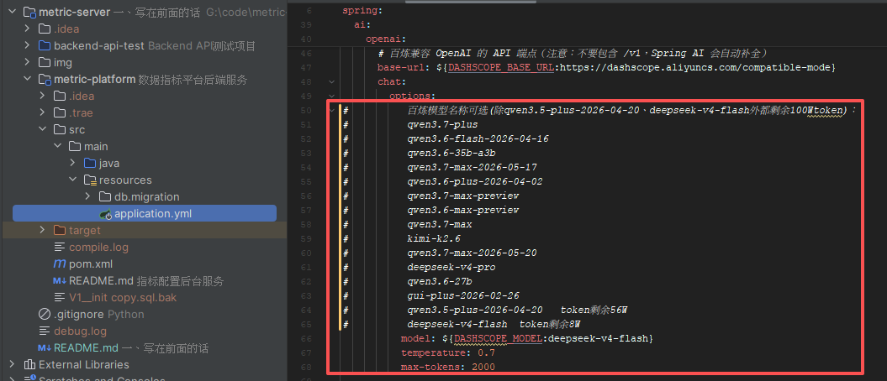
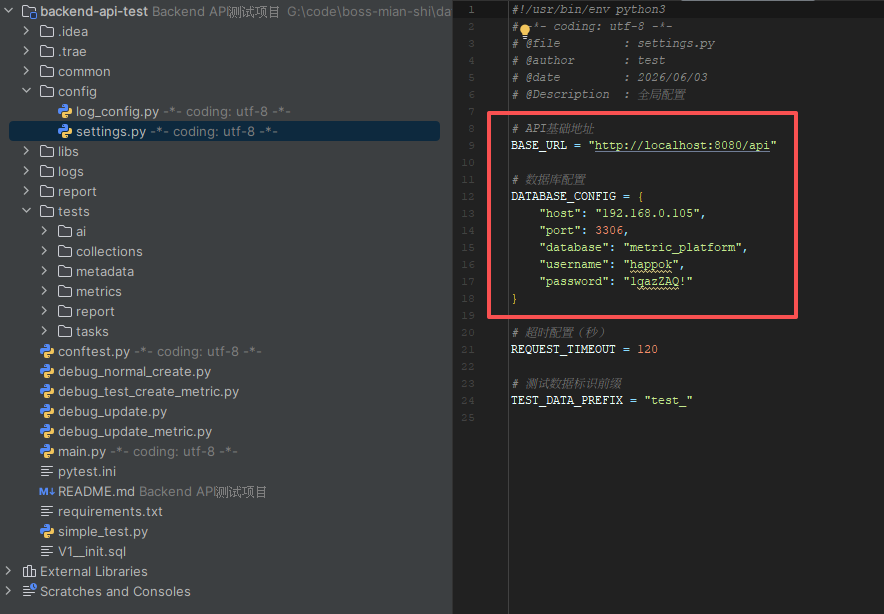
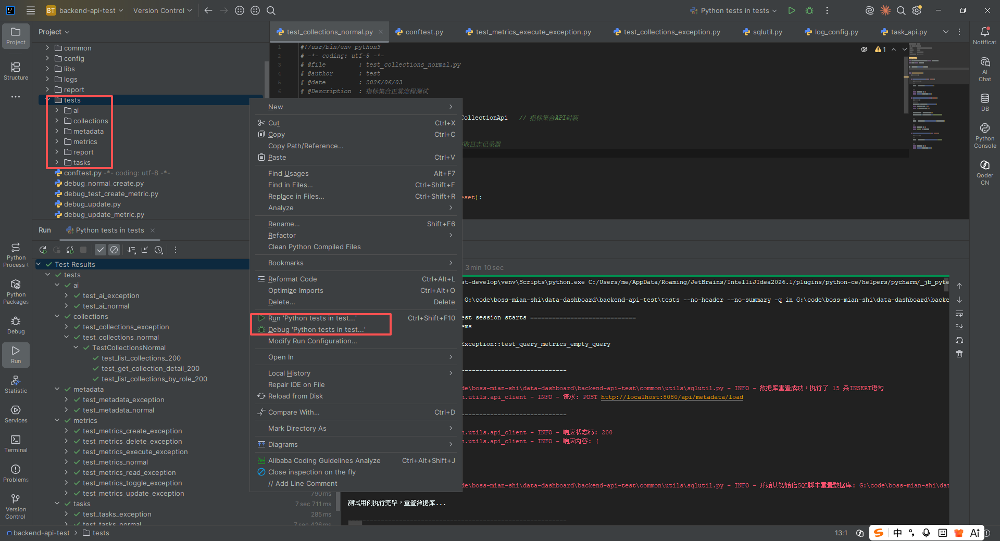
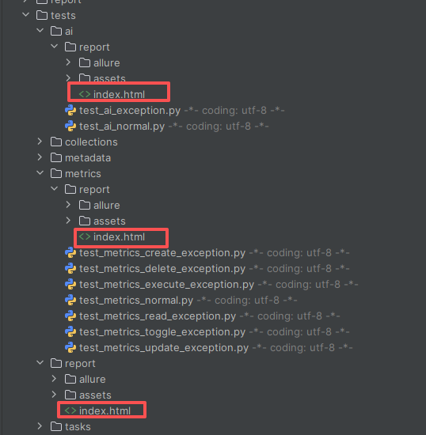
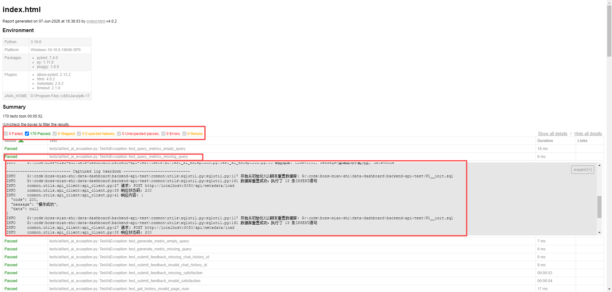

# 一、写在前面的话

## 1、数据库环境-**很重要！！！**

**开发测试环境数据库是mariadb:10.11, 请务必使用此版本，开发后期有意外切到mysql8数据库，发现不少测试用例报错，初步定位是版本差异导致，所以本项目请务必使用mariadb**

docker 启动脚本：

```shellscript
docker run -d \
  --name mariadb-10.11 \
  --restart unless-stopped \
  -p 3306:3306 \
  -v mariadb_data:/var/lib/mysql \
  -v mariadb_config:/etc/mysql/conf.d \
  -e MYSQL_ROOT_PASSWORD=1qazZAQ! \
  -e MYSQL_DATABASE=metric_platform \
  -e MYSQL_USER=root \
  -e MYSQL_PASSWORD=1qazZAQ! \
  mariadb:10.11
```

<br />

## 2、数据库环境重置-重要！

有两个地方会重置数据库：

1. java服务在启动的时候如果当前数据库是空的(flyway_schema_history表无数据)，则flyway会自动执行数据库初始化脚本resources/db/migration/V1__init.sql初始化数据库表结构。所以如果数据库有脏数据或者需要重置数据库，可以清空数据库，再重启java服务即可。
2. 在测试用例中，启动测试的时候会重置数据库，确保第一个测试用例的执行环境是稳定的，每个用例执行完成后会重置数据库，确保下一个测试用例的执行环境是稳定的。整个测试执行完成后，会重置数据库，恢复到初始化状态。重置的脚本也是V1__init.sql，所以如果数据库中已经有添加初始化sql脚本之外的数据了，请慎重执行测试用例，或者先进行业务数据备份。

## 3、大模型类型的交互差异

1. 在使用大模型调测的时候发现不同模型响应时长差异很大，deepseek-v4-flash模型生成一个查找指标大概10秒左右，但qwen3.5-plus-2026-04-20模型普遍需要四五十秒甚至一分钟以上。
2. 测试的时候建议优先使用带flash的模型，项目中sk-***带的deepseek-v4-flash模型token快完了...可以更换qwen3.6-flash-2026-04-16模型
   。
3. 经测试生成一个查询指标的token消耗大约4000\~6000，测试用例中的ai模块执行一遍大约消耗15Wtoken，这些数据量可以做个参考，有余额的token下图都有标注




<br />

## 4、测试用例执行方式



用IDEA打开项目backend-api-test项目(建议打开两个idea窗口，一个运行metric-platform项目，一个运行backend-api-test项目，便于操作)，配置python环境(开发环境-Python 3.10.6)，根据本地环境修改上图中的配置信息，在执行下面命令安装三方依赖库

```shellscript
pip install -r requirements.txt
```



如上图，然后再要测试测试用例目录、py脚本右键执行即可

测试用例报告会在当前执行目录中生成，每次执行的用例清单不同，生成的报告不同，如下图，报告中可以查看用例执行状态和日志(在使用swagger或其他工具测试接口的时候可以在这里查找相关用例获取请求参数)





## 5、交付物

- P-A 后端源码 metric-platform
- P-B 数据库脚本 resources/db/migration/V1__init.sql
- P-C API 文档 <http://localhost:8080/api/swagger-ui.html>
- P-D 技术文档 本文档，后台和测试用例详细说明参见各自的README.md文件
- P-E README 当前README.md文件、backend-api-test项目的README.md文件、metric-platform项目的README.md文件
- P-F 测试说明 测试用例项目backend-api-test，具体参见backend-api-test项目的README.md文件
- P-G AI 使用 本文档最后

# 二、系统设计

## 1、元数据管理

元数据管理这个模块它是整个系统的基础。为啥需要这个模块呢？因为业务人员不会直接写SQL，他们需要用的表和字段都得先被系统"认识"才行。元数据管理的作用就是把数据库里的表和字段信息加载到系统里，让后面的指标配置能用到。

核心功能：

1. 元数据加载：系统启动时或者手动触发时，会从数据库的 information_schema 里把表结构自动读出来，存到 data_source 和 field_metadata 这两张表里。不用人工一个一个去录入，省事多了。
2. 数据源管理：这里的"数据源"其实就是业务表，比如素材表 asset。可以管理哪些表可以用来做指标，哪些不能用（禁用掉）。
3. 字段属性配置：每个字段都可以设置它能不能被筛选、能不能被分组、能不能被聚合统计、能不能排序。比如状态字段适合分组，文件大小适合聚合求平均，而像标题这种就不太适合做统计，就可以把它的 aggregatable 设成 false。
4. 批量配置：支持一次性修改多个字段的属性，不用一个个去点，方便管理员快速初始化。

数据库表设计：

1. data_source 表：存数据源信息，有 source_code（唯一编码）、source_name（显示名称）、source_type（类型：表、视图、查询）这些字段。还关联着一堆字段。
2. field_metadata 表：存每个字段的详细信息，关联到 data_source。字段有 field_name（字段名）、field_type（类型：字符串、数字、日期、JSON、数组）、field_label（显示名称），还有四个 boolean 字段：filterable、groupable、aggregatable、sortable，分别控制这个字段能不能筛选、分组、聚合、排序。

交互关系：

1. 元数据管理是基础，先配置好元数据，后面才能创建指标。
2. 指标管理模块会用到元数据，创建指标时要选来源表、统计字段、分组字段、筛选条件，这些都要从元数据里读，而且会检查字段是否启用、是否允许做那个操作（比如禁用的字段就不能用来分组）。
3. 如果某个数据源或者字段被禁用了，用到它的指标也会被自动禁用，防止报错。

## 2、指标管理

指标管理是这个系统的核心模块，业务人员就是用这个来配置各种统计指标的，不用再找开发写SQL了。

核心功能：

1. 指标配置：可以创建和修改指标，配置的内容挺丰富的：
   基本信息：编码、名称、描述
   来源：选哪个数据表（从元数据里读）
   统计项：可以配多个！比如一个指标可以同时统计素材数量、平均文件大小、总播放量。每个统计项要选统计字段和聚合方式（count、sum、avg、max、min）。
   分组维度：可以选多个分组字段，比如按平台+城市分组统计。
   筛选条件：可以设固定的筛选条件，比如只统计已审核通过的素材。支持动态参数，比如开始日期和结束日期可以在执行时传。
   Having 条件：分组后的过滤，比如只显示素材数量大于10的分组。
   排序规则：结果怎么排序，支持多个排序字段。
   限制条数：比如只看前10名。
   窗口函数：这个是高级功能了，比如可以算每个平台内的播放量排名。
2. 指标分类：把指标分到不同的业务分类下，比如内容运营、审核管理、数据分析，方便查找。
3. 指标集合：可以把一些常用的指标打包成集合，比如"内容运营指标包"，按角色分配，比如内容运营人员一上来就看到这些指标。
4. 执行查询：配置好指标后，直接点击执行，系统会自动生成 SQL 去查数据，返回结果。支持传动态参数，比如不同的日期范围。

数据库表设计：

1. metric_config 表：指标主表。核心字段：metric_code：指标编码，唯一，程序里用这个来标识指标，source_table：来源表名，category_code：分类编码，group_by_fields：JSON格式，存分组字段数组，filter_conditions：JSON格式，存筛选条件，having_conditions：JSON格式，存having条件，sort_rules：JSON格式，存排序规则，limit_value：限制条数，window_functions：JSON格式，存窗口函数，enabled：是否启用，
2. metric_stat_item 表：指标的统计项，跟 metric_config 是一对多关系。一个指标可以有多个统计项，每个统计项有自己的编码、名称、字段名、聚合方式。
3. metric_category 表：指标分类表
   metric_collection 表：指标集合表，有 target_role 字段，标识这个集合是给哪个角色用的
4. metric_collection_item 表：集合和指标的关联表

交互关系：

1. 依赖元数据管理：创建指标时要从元数据里选表和字段，还要检查字段的状态和属性（比如选分组字段时，元数据里 groupable 得是 true）。
2. 给任务管理模块用：任务可以包含多个指标，定时或异步执行这些指标查询。
3. 给AI模块用：AI推荐指标或生成新指标时，会读写指标配置表。

## 3、任务管理

任务管理模块是用来处理那些耗时间的查询或者需要定时执行的查询的。比如有些SQL数据量很大，要跑半天，就不能让用户在那等着，得搞异步任务。

核心功能：

1. 创建任务：可以创建查询任务或导出任务（导出目前是返回JSON，实际项目可以做成Excel）。任务可以包含多个指标，每个指标还可以单独设置参数。支持两种执行模式：
   即时执行：创建后马上加入队列执行
   定时执行：配个Cron表达式，定时跑，比如每天凌晨1点统计前一天的数据
2. 任务队列：用本地内存队列实现，有个TaskConsumer在后台轮询，拿到任务就执行
3. 任务状态跟踪：可以看任务现在是待执行、执行中、成功还是失败。失败了会记录错误信息。还支持失败重试，达到最大重试次数就放弃。
4. 任务执行历史：每次执行都会存一条历史记录，想知道昨天这个任务跑的数据是啥，可以去历史记录里找。
5. 子指标进度：一个任务如果有多个指标，可以看每个指标的执行状态，哪些成功了哪些失败了，每个指标的结果都单独存着。
6. 任务控制：可以暂停定时任务、继续执行、取消任务、手动触发一次。

数据库表设计：

1. task 表：任务主表。核心字段：
   task_code：任务编码，唯一
   task_type：任务类型（query/export）
   execute_mode：执行模式（instant/scheduled）
   cron_expression：Cron表达式，定时任务用
   metric_configs：JSON格式，存这个任务要执行的指标列表，包含每个指标的编码和参数
   status：状态（pending/running/paused/success/failed/cancelled）
   retry_count：已重试次数
   started_at/finished_at：开始和结束时间
2. task_metric_item 表：任务里的每个指标项，关联 task 表。记录每个指标的执行状态、结果、错误信息、耗时。
3. task_execution_result 表：任务执行历史，每次执行存一条，包含执行时的状态、结果数据、错误信息、耗时、重试次数等。

交互关系：

1. 依赖指标管理：任务要执行的指标必须是已存在且启用的。
2. 用查询引擎执行：执行任务时，会调用查询引擎来执行每个指标的SQL。
   用本地内存做队列：任务创建后会推入队列，消费者从队列里拿任务执行。

队列方案选型考虑：项目中采用的是本地队列，好处是不依赖第三方的组件、系统简单，缺点是本地内存会有丢数据的风险，所以在任务入队之前先做了本地数据入库；但是再一想数据都入库了还需要队列吗，直接定时轮训数据库即可，这里的本地队列有些多余，但是考虑后面如果要更换真实的队列组件，这里保留这个本地队列的service服务视为一个接口，后续要更换队列只在这个服务内做扩展即可，所以项目中保存了本地队列服务。

## 4、AI取数

这是个柔性功能，让业务人员直接用自然语言说想要啥数据，AI要么推荐现成的指标，要么直接生成新指标配置。

核心功能：

1. 查询现有指标：用户输入像"帮我看看各平台的素材数量"，系统会去匹配已有的指标，把最相关的推荐给用户。
2. 生成新指标：如果没有现成的，用户可以说"帮我生成一个指标，统计每个城市已审核素材的平均播放量"，AI会自动生成指标配置并保存下来，用户直接就能用了。
3. 聊天历史：会把和AI的对话存下来，包括用户的问题、AI的响应、token消耗、用时等。
4. 反馈功能：用户可以对AI推荐或生成的指标进行满意度评价（满意/不满意），这些反馈数据以后可以用来优化AI。
5. 配置检查：可以检查阿里云百炼的API Key配置对不对，能不能连上。

数据库表设计：

1. ai_chat_history 表：存每次和AI的交互记录。核心字段：
   user_query：用户的问题
   source_interface：来源接口（是查询现有指标还是生成新指标）
   metric_id：关联的指标ID（如果有的话）
   metric_source：指标来源（EXISTING/GENERATED）
   satisfaction：满意度（SATISFIED/DISSATISFIED）
   ai_prompt：发给AI的完整提示词
   prompt_tokens/completion_tokens：输入输出token数
   ai_response：AI的响应内容
   request_duration_ms：请求耗时
2. ai_recommendation 表：存AI推荐记录（这个表其实主要是内部用，给AI优化做参考）

交互关系：

1. 调用阿里云百炼大模型：用Spring AI，通过OpenAI兼容的接口调用deepseek或者通义千问模型。
2. 读写指标数据：推荐指标时会读指标表，生成指标时会写入指标表。
3. 参考元数据：AI生成指标时，系统会把元数据信息（有哪些表、哪些字段、字段类型和属性）放在提示词里，这样AI生成的配置才符合系统的规则。


## 5. 各模块之间的关系总结

整个系统的数据流是这样的：

1. 先用元数据管理模块把业务表加载进来，配置好每个字段的属性
2. 然后业务人员或者管理员用指标管理模块创建各种指标，或者用AI模块快速生成指标
3. 需要实时看数据的，直接执行指标查询；需要批量查或者定时查的，建个任务
4. 任务管理模块负责异步执行，存好历史结果
5. 过程中产生的数据都在各自的表里，相互关联，形成完整的闭环

另外，整个系统都用了统一的异常处理、统一的Result返回格式，接口文档用Swagger自动生成，还加了Flyway数据库版本管理，这些都是工程化的东西，保证系统能稳定运行和维护。


# 三、后期改善

### 1. 指标管理-规则引擎方面（来自后续改进点文档）

```
1、查询指标时放弃了额外扩展条件，仅支持动态参数，额外扩展条件使用新建或者修改指标来实现；
2、指标修改的历史记录省略，但线上环境有业务价值，便于用户回溯之前的查询口径；
3、指标查询目标数据的分库分表本次没有考虑，线上环境需要根据分库分表规则进行数据源配置，或者增加数据路由规则；
4、查询指标缓存对应的sql没有实现，后续如果能扩展这个可以减少每次查询指标的规则解析开销；
5、不支持复杂的自定义统计算法，如“SUM(complete_play_count) * 1.0 / NULLIF(SUM(play_count), 0)"”等；
6、生产环境可以借鉴开源BI系统的规则引擎模块，避免手搓重复造轮子；
```

### 2. 异步任务方面

```
导出功能做了简化处理，这里只生成了json数据，没有导出生成表格文件，线上环境可以生成excel文件并配合minio存储。
目前只是一个单点的demo，生产环境建议集成 xx-job, powerjob, snailjob等成熟的分布式任务调度组件；
```

### 3. 测试用例方面

```
1、数据校验逻辑分两类-1-静态数据、2-动态数据。前者都是基于现有的初始化脚本进行测试和数据校验，接口测试稳定，但是不能更好的测试线上环境的数据问题；后者不依赖静态数据，能测试更大的场景，但是需要开发一个“数据裁决者”给用例执行的结果做是否通过的判断；
2、测试用例的跨业务叠加场景有待补充，比如元数据关闭了某些表或者字段对已有指标查询和已有异步任务的影响等，需要通过这个方式从单模块向上构建高层级的测试场景；
3、用例执行的数据环境可以做精细化控制，目前是在用例执行前重置数据库，保证用例运行环境的数据稳定，但是整个库重置开销大、耗时长，后续可以针对用例做后置重置处理，只重置用例影响的数据，类似JUnit的事务回滚效果，其次当前测试用例如果依赖初始化sql脚本之外的数据是通过调用业务接口准备的，这类也可以做成sql脚本或者中间环境进行沉淀，有类似的测试场景可提高复用性；
```

### 4. AI 取数方面

```
1、AI聊天记录沉淀：AI取数做聊天记录沉淀为常见问题答案，给后续的系统做知识库积累，包括指标推荐、指标生成；
2、AI交互策略优化：当系统有很多存量查询指标时，需要多次交互或者给指标分类分组维护摘要或使用向量数据库来提升准确性； 
3、指标生成容错：提示词的限制范围和执行引擎的规则解析能力有限，指标生成接口可能出现AI给了指标但执行报错的问题，建议用该指标创建测试用例, 再用AI分析后台异常原因调整规则引擎或提示词(但整体感觉还是优化迭代太慢，不如下面第5点) ；
4、行业特性适配: 线上数据繁多、需求差异化明显，影响因素包括业务数据的表数量、用户的产品行业、店铺运营阶段、数据分析用户的所在部门和岗位特性等，生产环境需要考虑规划 ；
5、直接SQL生成备选方案: AI 取数除了让大模型按后台代码中设计的执行规则生成 json 外，还可以让大模型执行根据用户的需求和元数据信息直接生成 SQL，这个思路或许能跳过规则引擎能力限制，毕竟 SQL 是更标准通用的接口，在配合sql的动态参数设置提高灵活性；
```

<br />

# 四、AI使用

1. 使用的AI工具是Trae。前期先人工分析需求、整理各模块的功能和交互关系，以及设计数据库表的核心字段及用途说明。
   然后将整理的内容按模块投喂给Trae的spec模式，然后由Trae生成详细的需求文档、任务拆解task、检查清单，审查这些开发文档，修改需要调整的地方，最后确认执行。
2. AI生成一个模块后会先用swagger测试接口，确认生成模块的主流程可用，并人工检查代码，然后让AI根据接口文档生成测试用例，最后执行测试用例，确认模块的功能是否正常。执行的异常信息回反馈给Trae，由Trae根据异常信息调整代码。有个别Trae多次调整都无法修复的问题会人工介入调试，这类大多数是运行时动态数据导致AI无法做静态分析导致，分析根因后告知Trae进行修改。
3. 在项目中的初始化数据也是基于Trae生成，告知其我的需求需求，比如条数、时间范围、业务指标复杂读和业务价值要求等等，然后由Trae根据需求生成初始化数据。这些数据会通过java代码执行，初始化到数据库中，确认初始化无误，生成的业务指标会通过测试用例进行全量执行，确认指标执行正常。
4. 整体AI生成代码的验证机制为测试用例为主，再配合手动测试和代码审查，确保代码质量和功能正确性。

